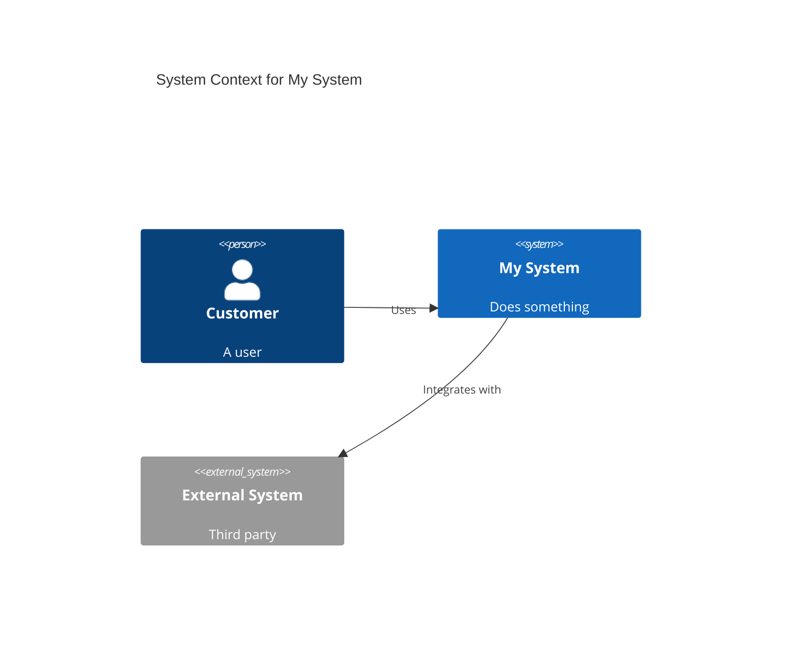

# C4 Model Architecture Diagrams

## Overview

The C4 Model is a hierarchical approach to software architecture visualization with four levels: **Context, Container, Component, Code**. Like maps at different zoom levels, each level serves different audiences and purposes.

**Core principle:** Use simple boxes and lines with clear abstraction levels - no complex UML notation needed.

## When to Use

**Use C4 when:**
- Documenting new or existing system architecture
- Onboarding developers to a codebase
- Planning system design or technical architecture
- Communicating with stakeholders at different technical levels
- Maintaining living architecture documentation

**Always create:**
- System Context (shows system boundaries and interactions)
- Container diagram (shows deployable units and technology)

**Conditionally create:**
- Component diagrams (only when internal complexity warrants it)
- Code diagrams (rarely - use IDE-generated instead)

## The Four Levels

```
┌─────────────────────────────────────────────────┐
│ 1. System Context                               │
│    Who uses it? What does it connect to?        │
│    Audience: Everyone                           │
│    Elements: 5-10 max                           │
└─────────────────────────────────────────────────┘
         │
         ▼
┌─────────────────────────────────────────────────┐
│ 2. Container                                    │
│    What are the deployable/runnable parts?      │
│    Audience: Technical & non-technical          │
│    Elements: 10-15 max                          │
└─────────────────────────────────────────────────┘
         │
         ▼
┌─────────────────────────────────────────────────┐
│ 3. Component                                    │
│    What's inside a container?                   │
│    Audience: Developers                         │
│    Elements: 10-15 per container                │
└─────────────────────────────────────────────────┘
         │
         ▼
┌─────────────────────────────────────────────────┐
│ 4. Code (Rarely Used)                           │
│    Implementation details (classes, etc.)       │
│    Use IDE-generated diagrams instead           │
└─────────────────────────────────────────────────┘
```

### Level 1: System Context

**Shows:** Your system + users + external systems

**Include:**
- Your software system (center)
- People who use it
- External systems it integrates with
- Relationships with descriptions

**Exclude:** Internal details, technology choices, deployment

**Example elements:** "Customer", "Internet Banking System", "Email System"

### Level 2: Container

**Shows:** High-level technical building blocks

**Container = Separately deployable/runnable unit:**
- Web/mobile applications
- APIs, serverless functions
- Databases, file systems
- Message queues/topics

**Important:** Container ≠ Docker container (though it could be deployed in one)

**Include technology:** "Java/Spring Boot", "PostgreSQL", "React/TypeScript"

### Level 3: Component

**Shows:** Internal structure of ONE container

**Component = Grouping of related functionality:**
- Controllers, services, repositories
- Modules with well-defined interfaces

**Only create when complexity justifies it.**

### Level 4: Code

**Shows:** Class diagrams, implementation details

**Recommendation:** Use IDE tools instead. Rarely maintain manually.

## Tooling Recommendations

### Structurizr DSL (Recommended for Complex Systems)

**Advantages:** Model-based (multiple diagrams from one source), version control friendly, rich features

```structurizr
workspace "System Name" {
    model {
        user = person "User" "Description"

        system = softwareSystem "My System" {
            webapp = container "Web App" "Description" "React"
            api = container "API" "Business logic" "Node.js"
            db = container "Database" "Data storage" "PostgreSQL"
        }

        external = softwareSystem "External System" "External"

        user -> webapp "Uses" "HTTPS"
        webapp -> api "Calls" "JSON/HTTPS"
        api -> db "Reads/writes" "SQL"
        api -> external "Integrates" "REST/JSON"
    }

    views {
        systemContext system "SystemContext" {
            include *
            autoLayout
        }

        container system "Containers" {
            include *
            autoLayout
        }

        theme default
    }
}
```

### C4-PlantUML (Recommended for Quick Diagrams)

**Advantages:** Familiar PlantUML syntax, excellent IDE support, easy to learn

```plantuml
@startuml
!include https://raw.githubusercontent.com/plantuml-stdlib/C4-PlantUML/master/C4_Container.puml

Person(customer, "Customer", "A user")
System_Boundary(c1, "My System") {
    Container(web, "Web App", "React", "UI")
    Container(api, "API", "Node.js", "Business logic")
    ContainerDb(db, "Database", "PostgreSQL", "Data storage")
}
System_Ext(external, "External System", "Third party")

Rel(customer, web, "Uses", "HTTPS")
Rel(web, api, "Calls", "JSON/HTTPS")
Rel(api, db, "Reads/writes", "SQL")
Rel(api, external, "Integrates", "REST")

SHOW_LEGEND()
@enduml
```

### Mermaid C4 (For GitHub Native Rendering)

**Advantages:** Renders natively in GitHub, simple syntax



**Limitation:** Experimental, fewer features than Structurizr/PlantUML

## Quick Reference

### Common Element Types

| Type | Context | Container | Component | Description |
|------|---------|-----------|-----------|-------------|
| Person | ✓ | ✓ | - | Human user |
| Software System | ✓ | - | - | Highest level abstraction |
| Container | - | ✓ | ✓ | Deployable/runnable unit |
| Component | - | - | ✓ | Structural building block |

### Relationship Patterns

```
[Element A] -> [Element B] "Description" "Technology"

Examples:
- "Uses", "Reads from", "Writes to", "Calls", "Sends data to"
- "HTTPS", "JSON/HTTPS", "SQL", "JDBC", "gRPC", "AMQP"
```

### Technology Annotations

- Web apps: "React", "Angular", "Vue", "Java/Spring MVC"
- APIs: "Node.js/Express", "Java/Spring Boot", "Python/FastAPI"
- Databases: "PostgreSQL", "MongoDB", "Redis"
- Queues: "RabbitMQ", "Kafka", "AWS SQS"

## Best Practices

### Visual Guidelines

1. **Keep diagrams simple** - Max 10-15 elements per diagram
2. **Use consistent colors** - Blue for internal, gray for external
3. **Add descriptions** - Brief text explaining what each element does
4. **Show direction** - Arrows indicate dependency/data flow
5. **Include technology** - Specify tech stack for containers

### Documentation Workflow

```
1. Start with System Context (always)
2. Create Container diagram (almost always)
3. Add Component diagrams (only when needed)
4. Store diagrams with code (version control)
5. Generate images in CI/CD
6. Embed in documentation
```

### Diagram-as-Code Best Practices

- Store `.dsl`, `.puml`, or `.mmd` files in version control
- Review diagram changes in PRs
- Automate image generation
- Keep diagrams DRY (Don't Repeat Yourself)
- Use includes/imports for shared elements

## Common Mistakes

### Abstraction Violations

❌ **Mixing levels** - Showing components in a Context diagram
❌ **Wrong granularity** - Showing classes in a Container diagram
❌ **Unclear boundaries** - Not distinguishing internal vs external

✅ **Keep levels separate** - One diagram per abstraction level
✅ **Use appropriate detail** - Match detail to audience
✅ **Mark external systems** - Use gray or "External" tag

### Modeling Errors

❌ **Container = Docker container** - Container means deployable unit
❌ **Libraries as containers** - Libraries are code, not deployable units
❌ **Showing external system internals** - Focus on your system's boundaries
❌ **Too many elements** - Over 15-20 becomes unreadable

✅ **Container = deployable unit** - Web app, API, database, queue
✅ **Dependencies as components** - Libraries are implementation details
✅ **External systems as black boxes** - Show interfaces only
✅ **Split complex diagrams** - Multiple views for different aspects

### Documentation Mistakes

❌ **Missing descriptions** - No context for what elements do
❌ **No technology annotations** - Can't understand tech stack
❌ **Stale diagrams** - Out of sync with code
❌ **No relationship labels** - Unclear how elements interact

✅ **Describe every element** - Brief explanation of purpose
✅ **Annotate technology** - Language, framework, database type
✅ **Keep updated** - Include in definition of done
✅ **Label all relationships** - "Uses", "Reads from", protocol

## Real-World Patterns

### Microservices Architecture

```structurizr
system = softwareSystem "E-Commerce" {
    apiGateway = container "API Gateway" "Routes requests" "Kong"
    userService = container "User Service" "User mgmt" "Node.js"
    orderService = container "Order Service" "Orders" "Java"
    userDb = container "User DB" "User data" "PostgreSQL"
    orderDb = container "Order DB" "Order data" "MongoDB"
    queue = container "Message Queue" "Async events" "RabbitMQ"
}

apiGateway -> userService "Routes to" "HTTPS"
apiGateway -> orderService "Routes to" "HTTPS"
orderService -> queue "Publishes to" "AMQP"
userService -> queue "Subscribes to" "AMQP"
```

### Authentication Flow

```plantuml
Container(spa, "SPA", "React", "Frontend")
Container(api, "API", "Node.js", "Backend")
Container(auth, "Auth Service", "Keycloak", "Authentication")

Rel(spa, auth, "Authenticates via", "OAuth2/OIDC")
Rel(spa, api, "Calls with", "JWT/HTTPS")
Rel(api, auth, "Validates tokens", "HTTPS")
```

### Event-Driven System

```plantuml
Container(producer, "Event Producer", "Java", "Generates events")
ContainerQueue(bus, "Event Bus", "Kafka", "Event routing")
Container(consumer1, "Consumer 1", "Python", "Processing")
Container(consumer2, "Consumer 2", "Spark", "Analytics")

Rel(producer, bus, "Publishes", "Kafka Protocol")
Rel(bus, consumer1, "Delivers", "Kafka Protocol")
Rel(bus, consumer2, "Delivers", "Kafka Protocol")
```

## Starting a New Diagram

### System Context (Start Here)

1. Identify your system's users (personas)
2. List external systems you integrate with
3. Draw relationships
4. Add brief descriptions

### Container Diagram (Next Step)

1. List all deployable units in your system
2. Include databases, queues, caches
3. Show communication protocols
4. Add technology choices

### Component Diagram (Optional)

1. Pick ONE complex container
2. Identify major structural elements (not every class)
3. Show internal dependencies
4. Document responsibilities

## CI/CD Integration

### GitHub Actions Example

```yaml
name: Generate Diagrams
on:
  push:
    paths: ['docs/architecture/**']
jobs:
  generate:
    runs-on: ubuntu-latest
    steps:
      - uses: actions/checkout@v3
      - name: Generate PlantUML diagrams
        run: |
          for f in docs/architecture/*.puml; do
            docker run --rm -v $PWD:/data plantuml/plantuml $f
          done
      - name: Commit images
        run: |
          git add docs/architecture/*.png
          git commit -m "Update diagrams" || true
          git push
```

## Resources

- **Official C4 Model:** https://c4model.com
- **Structurizr:** https://docs.structurizr.com
- **C4-PlantUML:** https://github.com/plantuml-stdlib/C4-PlantUML
- **Simon Brown's Book:** "The C4 Model for Visualising Software Architecture"
