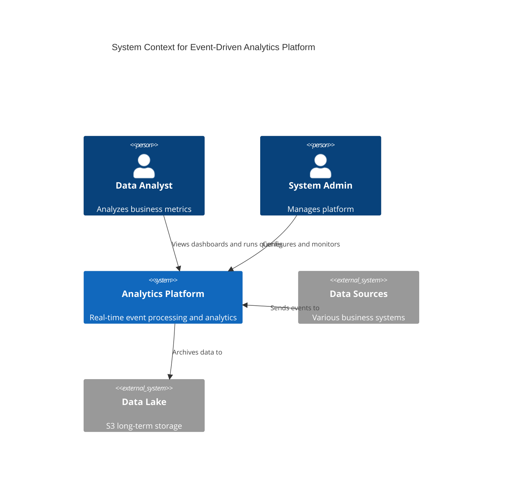

# C4 Model Complete Examples

This file contains complete, ready-to-use examples for different system types.

## Example 1: Internet Banking System (Structurizr DSL)

Complete workspace showing all diagram levels.

```structurizr
workspace "Internet Banking System" {
    model {
        # People
        customer = person "Personal Banking Customer" {
            description "A customer of the bank with personal accounts"
        }

        # Software Systems
        internetBanking = softwareSystem "Internet Banking System" {
            description "Allows customers to view information about their accounts and make payments"

            # Containers
            webApp = container "Web Application" {
                description "Delivers the static content and the single page application"
                technology "Java and Spring MVC"
            }

            spa = container "Single-Page Application" {
                description "Provides all banking functionality to customers via their web browser"
                technology "JavaScript and Angular"
            }

            mobileApp = container "Mobile App" {
                description "Provides limited banking functionality to customers via their mobile device"
                technology "React Native"
            }

            apiApp = container "API Application" {
                description "Provides Internet banking functionality via a JSON/HTTPS API"
                technology "Java and Spring Boot"

                # Components
                signinController = component "Sign In Controller" {
                    description "Allows users to sign in to the Internet Banking System"
                    technology "Spring MVC Rest Controller"
                }

                accountsController = component "Accounts Controller" {
                    description "Provides customers with account information"
                    technology "Spring MVC Rest Controller"
                }

                securityComponent = component "Security Component" {
                    description "Provides functionality related to signing in, changing passwords, etc."
                    technology "Spring Bean"
                }

                accountsRepository = component "Accounts Repository" {
                    description "Provides access to account data"
                    technology "Spring Repository"
                }
            }

            database = container "Database" {
                description "Stores user registration information, hashed authentication credentials, access logs, etc."
                technology "PostgreSQL 14"
                tags "Database"
            }
        }

        mainframe = softwareSystem "Mainframe Banking System" {
            description "Stores all of the core banking information about customers, accounts, transactions, etc."
            tags "External System"
        }

        emailSystem = softwareSystem "E-mail System" {
            description "The internal Microsoft Exchange e-mail system"
            tags "External System"
        }

        # Relationships - Context Level
        customer -> internetBanking "Views account balances and makes payments using"
        internetBanking -> mainframe "Gets account information from, and makes payments using"
        internetBanking -> emailSystem "Sends e-mail using"
        emailSystem -> customer "Sends e-mails to"

        # Relationships - Container Level
        customer -> webApp "Visits bigbank.com/ib using" "HTTPS"
        customer -> spa "Views account balances and makes payments using"
        customer -> mobileApp "Views account balances and makes payments using"
        webApp -> spa "Delivers to the customer's web browser"
        spa -> apiApp "Makes API calls to" "JSON/HTTPS"
        mobileApp -> apiApp "Makes API calls to" "JSON/HTTPS"
        apiApp -> database "Reads from and writes to" "JDBC"
        apiApp -> mainframe "Makes API calls to" "XML/HTTPS"
        apiApp -> emailSystem "Sends e-mail using" "SMTP"

        # Relationships - Component Level
        spa -> signinController "Makes API calls to" "JSON/HTTPS"
        spa -> accountsController "Makes API calls to" "JSON/HTTPS"
        mobileApp -> signinController "Makes API calls to" "JSON/HTTPS"
        mobileApp -> accountsController "Makes API calls to" "JSON/HTTPS"

        signinController -> securityComponent "Uses"
        accountsController -> accountsRepository "Uses"
        accountsRepository -> database "Reads from and writes to" "JDBC"
        securityComponent -> database "Reads from and writes to" "JDBC"
    }

    views {
        systemContext internetBanking "SystemContext" {
            include *
            autoLayout
        }

        container internetBanking "Containers" {
            include *
            autoLayout
        }

        component apiApp "Components" {
            include *
            autoLayout
        }

        styles {
            element "Software System" {
                background #1168bd
                color #ffffff
            }
            element "External System" {
                background #999999
                color #ffffff
            }
            element "Person" {
                shape person
                background #08427b
                color #ffffff
            }
            element "Container" {
                background #438dd5
                color #ffffff
            }
            element "Database" {
                shape cylinder
            }
            element "Component" {
                background #85bbf0
                color #000000
            }
        }

        theme default
    }
}
```

## Example 2: E-Commerce Microservices (C4-PlantUML)

### System Context

```plantuml
@startuml
!include https://raw.githubusercontent.com/plantuml-stdlib/C4-PlantUML/master/C4_Context.puml

LAYOUT_WITH_LEGEND()

title System Context diagram for E-Commerce Platform

Person(customer, "Customer", "A person who wants to purchase products online")
Person(admin, "Administrator", "Manages products and orders")

System(ecommerce, "E-Commerce Platform", "Allows customers to browse products and place orders")

System_Ext(payment, "Payment Gateway", "Stripe payment processing")
System_Ext(shipping, "Shipping Provider", "FedEx shipping integration")
System_Ext(email, "Email Service", "SendGrid email delivery")

Rel(customer, ecommerce, "Browses products, places orders", "HTTPS")
Rel(admin, ecommerce, "Manages catalog and orders", "HTTPS")
Rel(ecommerce, payment, "Processes payments using", "REST/JSON")
Rel(ecommerce, shipping, "Creates shipments using", "REST/JSON")
Rel(ecommerce, email, "Sends notifications using", "REST/JSON")
Rel_Back(email, customer, "Sends order confirmations to")

@enduml
```

### Container Diagram

```plantuml
@startuml
!include https://raw.githubusercontent.com/plantuml-stdlib/C4-PlantUML/master/C4_Container.puml

LAYOUT_WITH_LEGEND()

title Container diagram for E-Commerce Platform

Person(customer, "Customer")
Person(admin, "Administrator")

System_Boundary(c1, "E-Commerce Platform") {
    Container(web, "Web Application", "React/TypeScript", "Delivers the SPA to customer's browser")
    Container(spa, "Single-Page App", "React/TypeScript", "Provides e-commerce functionality via browser")
    Container(adminWeb, "Admin Portal", "React/TypeScript", "Admin interface for managing system")

    Container(apiGateway, "API Gateway", "Kong", "Routes and authenticates API requests")

    Container(userService, "User Service", "Node.js/Express", "Handles user authentication and profiles")
    Container(productService, "Product Service", "Java/Spring Boot", "Manages product catalog")
    Container(orderService, "Order Service", "Python/FastAPI", "Processes and tracks orders")
    Container(cartService, "Cart Service", "Node.js/Express", "Manages shopping cart")

    ContainerDb(userDb, "User Database", "PostgreSQL", "Stores user accounts and profiles")
    ContainerDb(productDb, "Product Database", "MongoDB", "Stores product catalog")
    ContainerDb(orderDb, "Order Database", "PostgreSQL", "Stores orders and order history")
    ContainerDb(cache, "Cache", "Redis", "Caches session and product data")

    ContainerQueue(queue, "Message Queue", "RabbitMQ", "Handles async communication between services")
}

System_Ext(payment, "Payment Gateway", "Stripe")
System_Ext(shipping, "Shipping Provider", "FedEx")
System_Ext(email, "Email Service", "SendGrid")

Rel(customer, web, "Visits", "HTTPS")
Rel(admin, adminWeb, "Uses", "HTTPS")

Rel(web, spa, "Delivers")
Rel(spa, apiGateway, "Makes API calls", "JSON/HTTPS")
Rel(adminWeb, apiGateway, "Makes API calls", "JSON/HTTPS")

Rel(apiGateway, userService, "Routes to", "HTTP")
Rel(apiGateway, productService, "Routes to", "HTTP")
Rel(apiGateway, orderService, "Routes to", "HTTP")
Rel(apiGateway, cartService, "Routes to", "HTTP")

Rel(userService, userDb, "Reads/writes", "JDBC")
Rel(userService, cache, "Caches sessions", "Redis Protocol")

Rel(productService, productDb, "Reads/writes", "MongoDB Driver")
Rel(productService, cache, "Caches products", "Redis Protocol")

Rel(orderService, orderDb, "Reads/writes", "SQLAlchemy")
Rel(orderService, queue, "Publishes order events", "AMQP")
Rel(orderService, payment, "Processes payments", "REST/JSON")
Rel(orderService, shipping, "Creates shipments", "REST/JSON")

Rel(cartService, cache, "Stores carts", "Redis Protocol")
Rel(cartService, productService, "Gets product info", "HTTP")

Rel(queue, email, "Triggers notifications", "AMQP → Webhook")

@enduml
```

### Component Diagram - Order Service

```plantuml
@startuml
!include https://raw.githubusercontent.com/plantuml-stdlib/C4-PlantUML/master/C4_Component.puml

LAYOUT_WITH_LEGEND()

title Component diagram for Order Service

Container(apiGateway, "API Gateway", "Kong", "Routes requests")
ContainerDb(orderDb, "Order Database", "PostgreSQL")
ContainerQueue(queue, "Message Queue", "RabbitMQ")
System_Ext(payment, "Payment Gateway", "Stripe")
System_Ext(shipping, "Shipping Provider", "FedEx")

Container_Boundary(c1, "Order Service") {
    Component(orderController, "Order Controller", "FastAPI Router", "Handles order API requests")
    Component(orderService, "Order Service", "Python Service", "Orchestrates order processing logic")
    Component(paymentService, "Payment Service", "Python Service", "Handles payment integration")
    Component(shippingService, "Shipping Service", "Python Service", "Handles shipping integration")
    Component(orderRepo, "Order Repository", "SQLAlchemy", "Provides data access to orders")
    Component(eventPublisher, "Event Publisher", "Pika Client", "Publishes order events to queue")
    Component(validator, "Order Validator", "Python Module", "Validates order data")
}

Rel(apiGateway, orderController, "Routes to", "HTTP")

Rel(orderController, orderService, "Uses")
Rel(orderController, validator, "Validates with")

Rel(orderService, orderRepo, "Persists orders")
Rel(orderService, paymentService, "Processes payment")
Rel(orderService, shippingService, "Creates shipment")
Rel(orderService, eventPublisher, "Publishes events")

Rel(paymentService, payment, "Calls", "REST/JSON")
Rel(shippingService, shipping, "Calls", "REST/JSON")
Rel(orderRepo, orderDb, "Reads/writes", "SQL")
Rel(eventPublisher, queue, "Publishes", "AMQP")

@enduml
```

## Example 3: Event-Driven Architecture (Mermaid)



## Example 4: Authentication & Authorization (PlantUML)

```plantuml
@startuml
!include https://raw.githubusercontent.com/plantuml-stdlib/C4-PlantUML/master/C4_Container.puml

title Container diagram - Authentication Flow

Person(user, "User", "An authenticated user")

System_Boundary(app, "Secure Application") {
    Container(spa, "Single-Page App", "React", "Frontend application")
    Container(api, "API Server", "Node.js", "Backend API")
    Container(authService, "Auth Service", "Keycloak", "Authentication & Authorization")
    ContainerDb(appDb, "App Database", "PostgreSQL", "Application data")
    ContainerDb(authDb, "Auth Database", "PostgreSQL", "User credentials & tokens")
}

Rel(user, spa, "Accesses", "HTTPS")
Rel(spa, authService, "1. Authenticates via", "OAuth2/OIDC")
Rel(authService, authDb, "Validates credentials", "JDBC")
Rel_Back(authService, spa, "2. Returns JWT token")
Rel(spa, api, "3. Calls with JWT", "HTTPS + Bearer token")
Rel(api, authService, "4. Validates token", "HTTPS")
Rel(api, appDb, "5. Queries data", "JDBC")

@enduml
```

## Example 5: Deployment Diagram (Structurizr DSL)

```structurizr
workspace "Deployment Example" {
    model {
        user = person "User"

        system = softwareSystem "Web Application" {
            webapp = container "Web App" "Frontend" "React"
            api = container "API" "Backend" "Node.js"
            db = container "Database" "Data" "PostgreSQL"
        }

        user -> webapp "Uses"
        webapp -> api "Calls"
        api -> db "Queries"

        prod = deploymentEnvironment "Production" {
            deploymentNode "AWS" {
                deploymentNode "us-east-1" {
                    deploymentNode "CloudFront CDN" {
                        webappInstance = containerInstance webapp
                    }

                    deploymentNode "ECS Cluster" {
                        deploymentNode "Load Balancer" "ALB" {
                        }

                        deploymentNode "API Service" "" "" "3" {
                            apiInstance = containerInstance api
                        }
                    }

                    deploymentNode "RDS" {
                        deploymentNode "Primary" {
                            dbPrimary = containerInstance db
                        }
                        deploymentNode "Replica" {
                            dbReplica = containerInstance db
                        }
                    }
                }
            }
        }
    }

    views {
        deployment system prod "Deployment" {
            include *
            autoLayout
        }

        theme default
    }
}
```

## Example 6: Message Queue Pattern (PlantUML)

```plantuml
@startuml
!include https://raw.githubusercontent.com/plantuml-stdlib/C4-PlantUML/master/C4_Container.puml

title Container diagram - Async Message Processing

System_Boundary(system, "Order Processing System") {
    Container(orderApi, "Order API", "Java/Spring", "Receives orders")
    ContainerQueue(orderQueue, "Order Queue", "RabbitMQ", "Order events")
    Container(paymentService, "Payment Service", "Python", "Processes payments")
    Container(fulfillmentService, "Fulfillment Service", "Go", "Manages shipping")
    Container(notificationService, "Notification Service", "Node.js", "Sends emails/SMS")
    ContainerDb(orderDb, "Order DB", "PostgreSQL")
}

Rel(orderApi, orderQueue, "Publishes order.created", "AMQP")
Rel(orderApi, orderDb, "Stores order", "JDBC")

Rel(orderQueue, paymentService, "Delivers order.created", "AMQP")
Rel(paymentService, orderQueue, "Publishes payment.completed", "AMQP")

Rel(orderQueue, fulfillmentService, "Delivers payment.completed", "AMQP")
Rel(fulfillmentService, orderQueue, "Publishes shipment.created", "AMQP")

Rel(orderQueue, notificationService, "Delivers all events", "AMQP")

AddRelTag("async", $lineStyle=DashedLine())
@enduml
```

## Tips for Using These Examples

1. **Structurizr DSL**: Save as `.dsl` file, use Structurizr Lite or CLI to render
2. **PlantUML**: Save as `.puml` file, render with PlantUML or IDE plugins
3. **Mermaid**: Embed directly in Markdown, renders on GitHub/GitLab

4. **Customize for your needs**:
   - Replace example names with your actual systems
   - Add/remove containers based on your architecture
   - Adjust technology stacks to match reality
   - Add more detail in descriptions

5. **Version control**: Store diagram source files alongside code
6. **Automate**: Set up CI/CD to generate PNG/SVG images
7. **Link to docs**: Reference diagrams in README and architecture docs
