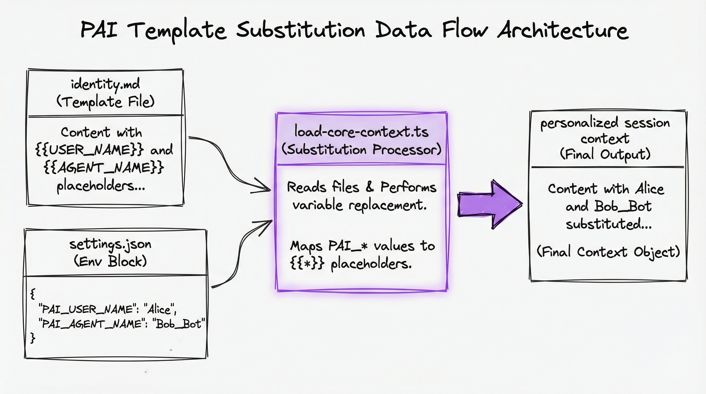
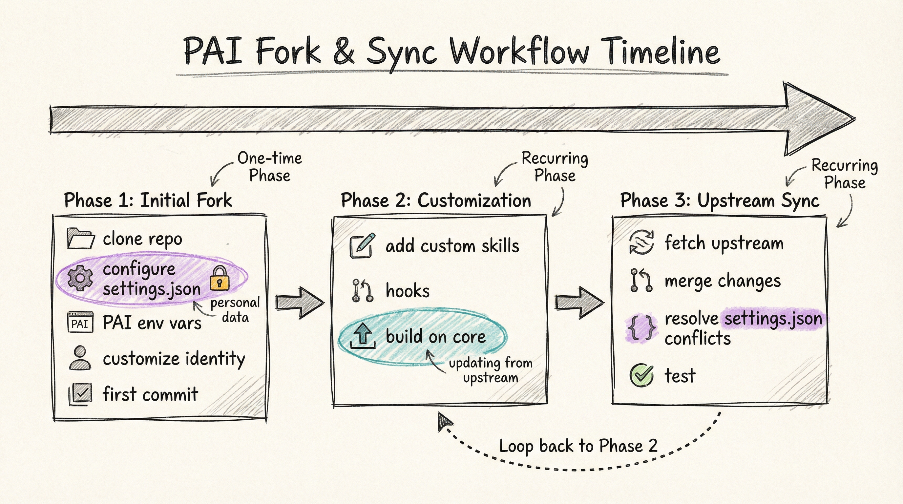
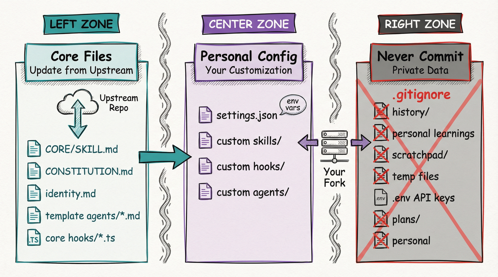

# Forking and Personalizing PAI

**Complete guide to making PAI yours**

> **New to PAI?** Start with [GETTING_STARTED.md](./GETTING_STARTED.md) first.

---

## Overview

PAI is designed to be forked and customized. This guide shows you how to:
- Configure your personal identity (name, email, organization)
- Create custom skills and agents
- Keep your fork synced with upstream updates
- Extend PAI without modifying core files

### What Forking Means

When you fork PAI, you're creating your own personalized version while maintaining the ability to pull updates from upstream (Daniel's repository). The key insight:
- **Core files stay generic** (update from upstream)
- **Personal data lives in env vars** (your customization)
- **Clean separation** enables safe syncing

---

## Understanding the Configuration System


*Figure 1: PAI template substitution data flow - how personal identity flows from settings.json to your session*

**Key Insights:**
- Core files contain `{{VARIABLES}}` templates (committed to git, safe for upstream)
- settings.json env block holds your personal values (PAI_USER_NAME, PAI_AGENT_NAME, etc.)
- load-core-context.ts hook performs substitution at every session start
- Final session context is fully personalized without modifying core files

### How It Works

PAI uses a **template substitution system** that separates core code from personal data:

1. **Core Files** (committed to git):
   - `skills/CORE/SKILL.md` - System configuration (de-personalized)
   - `skills/CORE/CONSTITUTION.md` - Architecture docs (de-personalized)
   - `skills/CORE/identity.md` - Identity template with `{{VARIABLES}}`
   - `agents/*.md` - Agent definitions (de-personalized)

2. **Personal Configuration** (your customization):
   - `settings.json` env block - Your PAI_* environment variables
   - These values fill in the `{{VARIABLES}}` in identity.md at session start

3. **Runtime** (session start):
   - `load-core-context.ts` hook reads identity.md
   - Substitutes `{{USER_NAME}}` → your PAI_USER_NAME value
   - Injects personalized context into session

### Template Variables

Available template variables in `identity.md`:

| Variable | Purpose | Required | Default |
|----------|---------|----------|---------|
| `{{USER_NAME}}` | Your name | No | "User" |
| `{{AGENT_NAME}}` | Your assistant's name | No | "Assistant" |
| `{{USER_EMAIL}}` | Your email | No | "" |
| `{{USER_LOCATION_CITY}}` | Your city | No | "" |
| `{{USER_LOCATION_COUNTRY}}` | Your country | No | "" |
| `{{USER_LOCATION}}` | City + Country | No | "" |
| `{{USER_TIMEZONE}}` | Your timezone | No | "" |
| `{{USER_ROLE}}` | Your job title | No | "" |
| `{{USER_ORGANIZATION}}` | Your company | No | "" |
| `{{VOICE_ID}}` | ElevenLabs voice ID | No | "" |

See `.claude/.env.example` for complete configuration options.

---

## Configuring Your Identity

### Quick Personalization

Edit `~/.claude/settings.json` and add your identity to the `env` block:

```json
{
  "env": {
    "PAI_USER_NAME": "Your Full Name",
    "PAI_AGENT_NAME": "Your Assistant Name",
    "PAI_USER_EMAIL": "your.email@example.com",
    "PAI_VOICE_ID": "your_elevenlabs_voice_id"
  }
}
```

### Complete Configuration

Add all optional fields for full personalization:

```json
{
  "env": {
    "PAI_USER_NAME": "Tony Stark",
    "PAI_AGENT_NAME": "Jarvis",
    "PAI_USER_EMAIL": "tony@stark.com",
    "PAI_USER_LOCATION_CITY": "Malibu",
    "PAI_USER_LOCATION_COUNTRY": "USA",
    "PAI_USER_TIMEZONE": "Pacific Time (PT)",
    "PAI_USER_ROLE": "CEO & Chief Engineer",
    "PAI_USER_ORGANIZATION": "Stark Industries",
    "PAI_VOICE_ID": "your_elevenlabs_voice_id_here"
  }
}
```

### Apply Configuration

**Restart Claude Code** to apply changes. Template substitution happens at session start.

---

## Advanced Customization

### Creating Custom Skills

Create your own domain-specific skills:

```bash
mkdir ~/.claude/skills/my-domain
```

**Skill structure:**
```markdown
---
name: my-domain
description: |
  My custom domain expertise.

  USE WHEN user says 'my domain task', 'custom workflow'.
---

# My Domain Skill

## Workflows

### Task 1
1. Step 1
2. Step 2
```

Skills auto-activate based on natural language triggers in the `description` field.

### Creating Custom Agents

Modify agent personalities in `~/.claude/agents/`:

```markdown
---
name: my-engineer
voice_id: your_elevenlabs_voice_id
---

# My Custom Engineer

Custom instructions for your engineering agent...
```

### Customizing Voices

Configure voice IDs for each agent in `identity.md` or create agent-specific voice files.

---

## Keeping Your Fork Synced


*Figure 2: PAI fork and sync workflow timeline - safe process for keeping your fork updated*

**Key Insights:**
- Initial fork is one-time setup (configure identity, customize)
- Upstream sync is recurring and safe (core files update, personal config preserved)
- Conflicts typically only in settings.json (easy to resolve)
- Loop back to customization after each sync (build on updated core)

### Sync with Upstream

```bash
# Add upstream remote (one-time)
git remote add upstream https://github.com/danielmiessler/Personal_AI_Infrastructure.git

# Fetch latest changes
git fetch upstream

# Merge upstream changes
git merge upstream/main

# Resolve any conflicts (usually in settings.json)
```

### Handling Conflicts

**Common conflict: `settings.json`**

Your personal env vars vs upstream changes:

```bash
# Keep your personal env vars
git checkout --ours settings.json

# Or manually merge both versions
```

**Best Practice:**
- Keep personal customizations in: `settings.json` env block, `identity.md`
- Core files should match upstream (SKILL.md, CONSTITUTION.md, agents/*.md)

---

## File Organization


*Figure 3: PAI three-zone file organization - what to update from upstream, customize, and never commit*

**Key Insights:**
- Core files (teal zone): Pull updates from upstream, stay generic
- Personal config (purple zone): Your customizations, commit to YOUR fork only
- Private data (red zone): Never commit, already in .gitignore
- Clear separation prevents data leaks and lost work

### What to Commit (Your Fork)

✅ **Commit these:**
- `settings.json` (with your personal env vars)
- Custom skills in `skills/your-domain/`
- Custom hooks in `hooks/your-custom-hook.ts`
- Custom agents in `agents/your-agent.md`

❌ **Don't commit these:**
- `history/` - Personal learnings and sessions
- `scratchpad/` - Temporary working files
- `.env` - API keys and secrets
- `plans/` - Personal planning documents

*These are already in `.gitignore`*

### What to Customize

**Core files (inherit from upstream):**
- `.claude/skills/CORE/SKILL.md` - System config (update from upstream)
- `.claude/skills/CORE/CONSTITUTION.md` - Architecture (update from upstream)
- `.claude/skills/CORE/identity.md` - Template (update from upstream)
- `.claude/agents/*.md` - Agent definitions (update from upstream)

**Personal files (your customization):**
- `.claude/settings.json` - Your env vars, hook configurations
- `.claude/hooks/load-*-context.ts` - Your custom context hooks
- `.claude/skills/your-domain/` - Your custom skills

---

## Advanced: Custom Context Hooks

PAI supports **extension hooks** for project-specific context that auto-loads based on your environment.

### What Are Context Hooks?

**Example:** Auto-load work context when in work projects
- Detects you're in `/work/` directory or company git repo
- Automatically loads work-specific context (coding standards, team info, compliance rules)
- No manual skill activation needed

### When to Use

- **Work vs Personal** - Different context for different projects
- **Domain Expertise** - Healthcare, finance, security-specific rules
- **Client Projects** - Per-client customizations
- **Technology Stack** - Language/framework-specific best practices

### Quick Example

```typescript
// hooks/load-work-context.ts
function detectWork() {
  const cwd = process.cwd();
  return cwd.includes('/work/') ||
         cwd.includes('/company-projects/');
}

// Auto-loads skills/work-context/SKILL.md when detected
```

### Want the Full Pattern?

→ **See [EXTENSION_PATTERN.md](./EXTENSION_PATTERN.md)** for comprehensive guide with:
- Complete implementation template (copy-paste ready)
- 5 detection methods (directory, git, env var, marker, combined)
- Real-world examples (k-health-context reference implementation)
- Troubleshooting and best practices
- 800+ lines of detailed documentation

---

## Troubleshooting

### Issue: Identity Not Loading

**Symptom:** Session shows "User" and "Assistant" instead of your configured names.

**Solution:**
1. Check `settings.json` has PAI_USER_NAME and PAI_AGENT_NAME in env block
2. Restart Claude Code
3. Check terminal output for "⚠️  PAI Identity not configured" warning

### Issue: Template Variables Not Substituting

**Symptom:** Identity.md shows `{{USER_NAME}}` instead of actual name.

**Solution:**
1. Verify `load-core-context.ts` has template substitution logic
2. Check `hooks/lib/pai-identity.ts` exists and exports variables
3. Run: `bun run ~/.claude/hooks/load-core-context.ts` to test

### Issue: Upstream Merge Conflicts

**Symptom:** Git conflicts when merging upstream changes.

**Solution:**
```bash
# Accept upstream for core files
git checkout upstream/main -- .claude/skills/CORE/SKILL.md
git checkout upstream/main -- .claude/skills/CORE/CONSTITUTION.md

# Keep your settings.json
git checkout --ours .claude/settings.json

# Commit merge
git commit -m "Merge upstream changes, keep personal config"
```

---

## Best Practices

### Separation of Concerns

- **Core code stays generic** - Update from upstream
- **Personal data goes in env vars** - Customize after forking
- **Custom workflows go in personal skills** - Your domain expertise

### Version Control

- Commit your customizations to your fork
- Pull upstream updates regularly
- Keep personal and upstream changes separate

### Security

- Never commit API keys (use .env)
- Review .gitignore before pushing
- Use .pai-protected.json patterns for validation

### Documentation

- Document your custom skills
- Add comments to custom hooks
- Keep README updated with your setup

---

## Migration from Old PAI

If you have an existing PAI installation with hardcoded values:

### Step 1: Backup Your Data

```bash
cp -r ~/.claude ~/.claude.backup
```

### Step 2: Update Core Files

```bash
# Pull latest de-personalized core files
git pull upstream main

# Your settings.json will have conflicts - resolve by keeping your env vars
```

### Step 3: Convert Personal Data to Env Vars

Extract your personal data from old files and add to `settings.json`:

```json
{
  "env": {
    "PAI_USER_NAME": "extracted from old identity.md",
    "PAI_AGENT_NAME": "extracted from old SKILL.md",
    // ... other values
  }
}
```

### Step 4: Verify Configuration

```bash
# Restart Claude Code
# Check session start output shows your personalized name
```

---

## Next Steps

**Advanced Customization:**
→ [EXTENSION_PATTERN.md](./EXTENSION_PATTERN.md) - Auto-loading context hooks for sophisticated customization

**Deep Dive:**
→ [CONSTITUTION.md](../.claude/skills/CORE/CONSTITUTION.md) - PAI architecture and principles
→ [PAI_CONTRACT.md](../PAI_CONTRACT.md) - What PAI guarantees vs what needs configuration

**Community:**
→ Share your customizations with the PAI community
→ Contribute improvements back to upstream

---

**You now have a fully personalized PAI that stays in sync with upstream improvements!**
